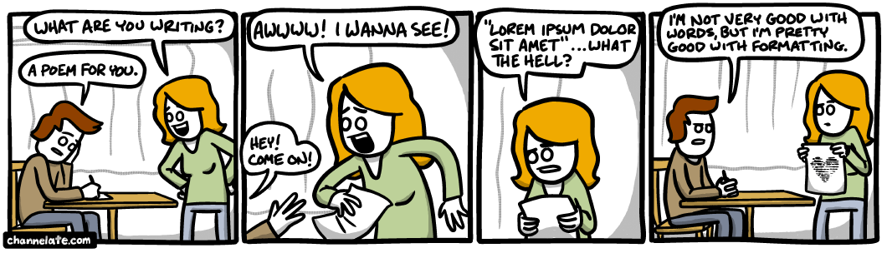

:scrollbar:

:toc2:

== Lab Title

Describe in this first paragraph an introduction knowledge about what is about to happen in the lab, and the knowledge the student will get, sort of "selling the lab" and generate expectation. Describe the Business Use case and lab predecessors.
Use link:https://asciidoctor.org/docs/asciidoc-writers-guide/[AsciiDoc format]

.Goals
Goals serve as a check list of the steps to be performed, during this lab the student will:
* Step 1 title
* Step 2 Title
* Step 3 Title

Example:
* Requesting an Openshift Environment
* Installing my project in openshift
* Integrating external tools with my project
* Testing that it works

.Prerequisites
* You need to know this before starting
* I assume you have installed this in your environment
* I assume you have access to this resource: link:https://www.openshift.org/download.html[Link caption]

:numbered:

== Step 1 title

In this section you will perform this action

=== Step 1.1 sub title

In this section you will perform this action, to complete the action perform these steps:

. Step 1
+
image:images/lorem_ipsum.png[]
. Step 2
+

==== A Step 1.1.1 sub title
Is not common to have a 3rd level sub title, but in case it happens, you should also be able to do it.

. Step 1
. Step 2

== Editor

I like the link:https://atom.io/[Atom editor] with link:https://atom.io/packages/asciidoc-preview[Asciidoc preview package] to preview my labs, you of course can use your preferred flavor.

The .adoc files in gitHub are rendered in a visible format for the students, if you share the gitHub repository with them, it will be happily displayed as intended (sort of, there is a small gap between the local preview and the live format at gitHub). If you would like to share an html format instead, I recommend using link:https://asciidoclive.com/edit/scratch/1[Asciidoc live].
